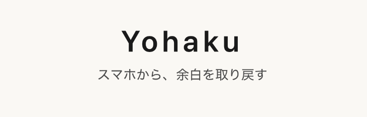
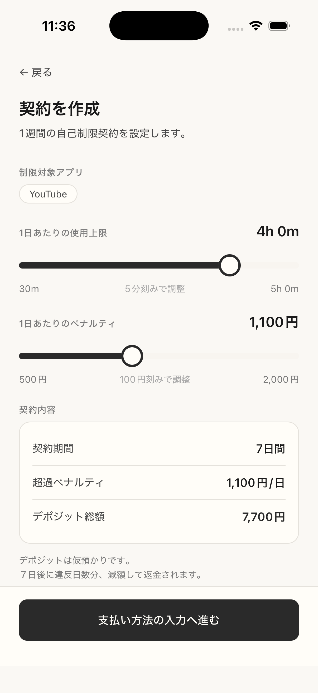
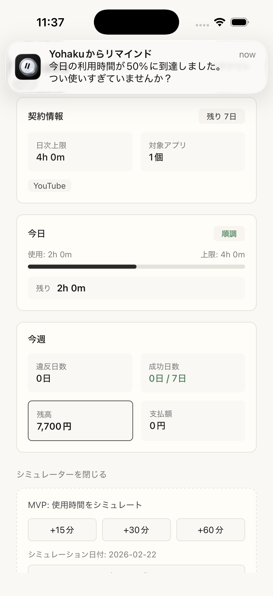
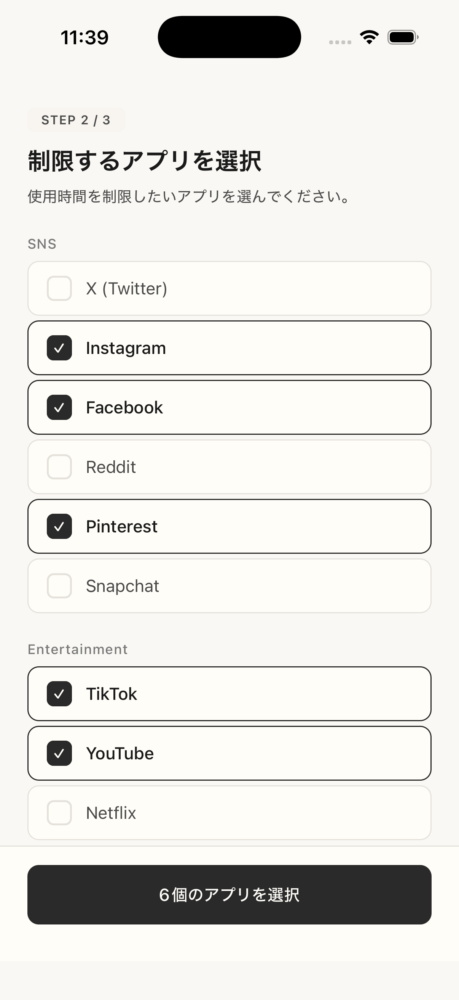

# Yohaku

> 無理なく継続できる脱スマホアプリ  
> 「スマホを減らす」ためではなく、「本当にしたいことに向き合う余白」を取り戻すためのプロダクト

## チーム名
- Life Forward

---

## 1. プロダクト概要

### どんな「本当に欲しい」に着目したか
Yohaku が解決したいのは、単なる「スマホ利用時間の削減」ではありません。  
本当に欲しいものは、以下です。

- 自分の本当にしたいことに向き合える、時間と心の余白
- 意志力に頼らなくても継続できる、行動の仕組み

既存の脱スマホアプリは、抑制や可視化はできても「最終的に解除できる」ケースが多く、衝動に負ける瞬間を防ぎ切れない課題がありました。

### どんなアプローチで「本当に欲しい」を実現したか
Yohaku は、以下の構造で継続性を作ります。

- 1週間単位の「契約」を結ぶ
- 日次上限と日次ペナルティ額を先に決める
- 超過時は違反を記録し、台帳残高に反映する
- 1日1違反・1ユーザー1アクティブ契約をデータ制約で担保する

つまり、意志の強さではなく「破りにくい約束の仕組み」で余白を作る設計です。

---

## 2. プロダクトの機能

### 実装済み（MVP）
- Supabase匿名認証（セッション復元あり）
- 契約作成フロー  
  `PickApps -> CreateContract -> Payment -> ConfirmContract -> Dashboard`
- 契約条件設定
  - 契約期間: 7日
  - 日次上限時間
  - 対象アプリ選択
  - 日次ペナルティ: `500-2000円`（`100円`刻み）
  - デポジット: `penalty_per_day * 7`
- 違反記録（Edge Function + RPC）
  - 1契約1日1違反を冪等で記録
  - 台帳（`ledger_entries`）へ減算反映
- ダッシュボード表示
  - 今日の使用量、上限、違反状態
  - 今週の違反日数/成功日数
  - 残高/支払額
- 擬似ロック体験
  - OS強制ロックではない
  - アプリ内状態同期によりロック/解除状態を再現
- 通知機能
  - 閾値到達時のローカル通知（重複通知抑止あり）

### 現在はMVP制約として割り切っているもの
- Screen Time API の本運用（FamilyControls / ManagedSettings / DeviceActivity）は未接続
- 実決済の最終確定・返金運用は未適用

---

## 3. 使い方・デモ

### デモの基本導線
1. アプリ起動（匿名セッション自動復元）
2. 対象アプリ選択
3. 日次上限・ペナルティを設定して契約を作成
4. 使用時間シミュレーションで上限超過を再現
5. 違反記録と残高変化をダッシュボードで確認
6. 日付進行で翌日状態を確認

### デモ動画
- [YouTube Shorts](https://youtube.com/shorts/Sgt2vL_yQg4?feature=share)

### デモ環境のビルド手順
- セットアップ/起動手順は `docs/build-guide.md` を参照

---

## 4. 技術面でのこだわり

### 4.1 「モックでも運用可能なロジック」を優先
Screen Time API 本連携はMVPで未実装ですが、Apple Developer Program（年額）/ entitlement / 審査準備の運用コストが大きく、ハッカソンではコアロジック実装を優先しました。APIdocumentを参照しながら実装したため、課金すればリリースは可能。

以下の運用ロジックは既に完成しています。

- 契約作成
- 違反判定と日次記録
- 台帳残高の整合
- 起動時復元と状態同期

そのため、ネイティブ連携を追加しても、契約運用の中核ロジックの大部分を再利用できる設計です。

### 4.2 データ整合性をDB制約で担保
- `contracts`: 1ユーザー1アクティブ契約（partial unique index）
- `violations`: 1契約1日1違反（unique制約）
- `record_violation` RPC: 冪等処理で多重記録を防止

### 4.3 決済の扱い
- MVPの課金確定はモック運用
- ただし Stripe 連携自体は実装済み
  - PaymentIntent作成
  - 契約作成時のPaymentIntent検証
  - Supabase匿名ユーザーIDをPaymentIntent metadataに埋め込み、サーバー側で照合
  - MVPではテスト運用前提（最終精算ロジックは未適用）
  - カード情報はStripe SDK経由で処理し、アプリ/自前サーバーでカード番号を保持しない

### 4.4 バックエンド実装
- Supabaseはクラウド本番環境を使用
- StripeはSandbox環境を使用
- Edge Functions (`create-payment-intent`, `create-contract`, `record-violation`) で認証付きサーバー処理を実装
- 契約作成時に決済情報・ユーザー情報・金額整合をサーバー側で検証
- 違反記録はRPCで冪等化し、同日多重減算を防止

### 4.5 セキュリティ設計（金銭を伴う前提）
- RLS + 認証ユーザー制約で他ユーザーのデータ参照を防止
- `contracts` の partial unique制約で同時アクティブ契約を防止
- `violations` の unique制約で1日1違反をDBで保証
- `record_violation` RPCは `service_role` 経由のみ実行可能に制限
- 匿名ログインでもユーザーIDを一貫利用し、契約・違反・決済リクエストの整合を維持

### 4.6 Apple審査を見据えた方針
金銭コミットメントの行き先は、Apple審査に配慮し、公式に認められた非営利団体への拠出を想定した運用方針で設計しています（最終運用時に法務・審査要件を精査）。

---

## 5. UI/UX面でのこだわり

- 彩度を落とした素朴なトーンを採用
- 刺激の強い演出を避け、衝動的な再使用を助長しない
- 契約・違反・残高の状態を1画面で把握できる情報設計
- 「今日」「今週」の区切りで、意思決定の単位を明確化

見た目の派手さよりも、継続行動を支える落ち着いた体験を優先しました。

### UIスクリーンショット

---

## 6. 将来の展望

- Screen Time API本連携（OSレベルの制限）
- 実決済精算（違反分capture / 達成分cancel）
- 非営利団体への拠出フロー本実装
- 取り戻した時間の可視化・振り返り機能強化

---

## 7. 補足ドキュメント

- 設計概要: `docs/design_doc.md`
- ビルド手順: `docs/build-guide.md`
- iOS制約: `docs/ios-capabilities.md`
